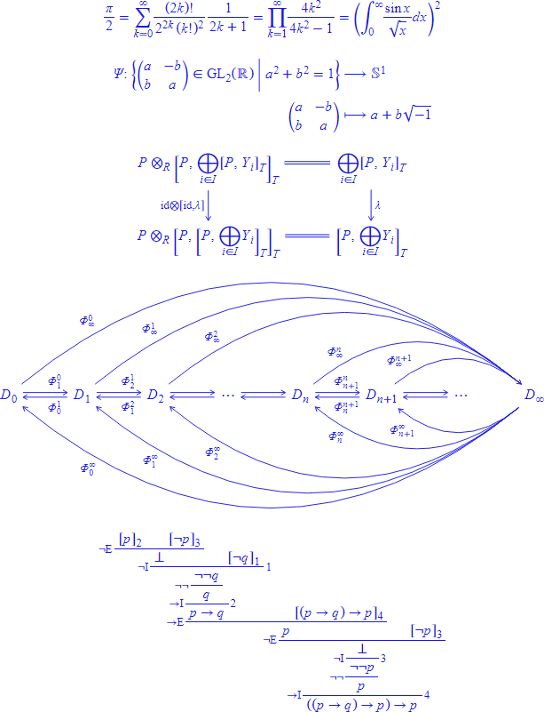

<div align="center">
<h1>Zotica</h1>
</div>

## 概要

Zotica とは、[ZenML](https://github.com/Ziphil/Zenithal) ライクな文法で数式を記述できるマークアップ言語です。
処理系を通すことで HTML 要素に変換され、専用の CSS ＋ JavaScript を適用することで、Web ページ内に数式を表示することができます。
TeX と同程度の品質の数式を組めることと、出力される HTML が難読なものにならないようにすることを目指しています。

ブラウザ上で数式を表示するエンジンとしては、すでに [MathJax](https://www.mathjax.org/) や [KaTeX](https://katex.org/) などがあります。
これらとの違いは主に以下の 3 点です。

- 記号以外は本文フォントを継承して描画するので数式だけ本文から浮いてしまうことがない
- 出力される HTML の構造が比較的簡潔
- CSS を上書きするだけで要素間のスペーシングを比較的簡単にカスタマイズできる

以下は、Zotica による数式の出力例です (Google Chrome でのキャプチャ画像)。

<div align="center">

</div>

もしくは、描画サンプルページをご覧ください。

- [描画サンプルページ](https://ziphil.github.io/ZenithalMathWebDemo/main.html)

Zotica の仕様は以下の通りです。
現在は試案段階で、突然変更になる可能性がありますので、利用する際は注意してください。

- [バージョン 1.0](document/zotica/1.0.md) (策定中)

このリポジトリは、Ruby 実装の ZenML パーサーである `ZenithalParser` クラスを拡張した `ZoticaParser` クラスを提供します。
このクラスは通常の ZenML パーサーと同じように ZenML ドキュメントをパースしますが、引数の内容が Zotica で書かれたマクロを処理できるようになっています。

## インストール
RubyGems からインストールできるようになる予定です。
```
gem install zotica
```

## 使い方

### Ruby とか ZenML とかよく分からない場合
Ruby や ZenML はよく分からないが、とりあえず Zotica で数式をレンダリングしてみたいという場合は、以下のドキュメントを参考にしてください。

- [チュートリアル](document/tutorial.md)

### すでに ZenML を使っている場合
`ZenithalParser` の代わりに `ZoticaParser` インスタンスを作成します。

このクラスには `register_math_macro` メソッドが追加されており、引数の内容が Zotica で書かれるマクロを登録することができます。
このマクロに渡されるノードは、ドキュメント上の該当マクロの引数として記述された Zotica の構造そのものではなく、それが HTML 要素に変換されたものになります。

Zotica が出力する HTML 要素を正しく表示するには、専用の CSS と JavaScript を適用する必要があります。
このクラスのパーサーを使うと、`math-resource` マクロによって必要な CSS と JavaScript を埋め込むことができます。

詳しくは以下のコードを参照してください。
```ruby
# ライブラリの読み込み
require 'rexml/document'
require 'zenml'
require 'zotica'
include REXML
include Zenithal
# パーサーの作成
source = File.read("sample.zml")
parser = ZoticaParser.new(source)
# Zotica マクロの登録
parser.register_math_macro("m") do |attributes, children_list|
  # children_list には ZenML ドキュメント上で該当マクロに渡された各引数を HTML に変換したものが渡される
  # ここではそれをそのまま返して HTML として表示させている
  next children_list.first
end
```
このようにすると、以下のような ZenML ドキュメントがパースできます。
```
\zml?|version="1.0"|>
\xml?|version="1.0",encoding="UTF-8"|>
\html<
  \head<
    ## 数式を正しく表示するための CSS と JavaScript を埋め込む
    &math-resource|url="font.otf"|>
  >
  \body<
    \p<
      ## 登録したマクロ内に Zotica が書ける
      2 次方程式 &m<a \sp<x><2> + bx + c = 0> は &m<\sp<b><2> - 4ac = 0> のとき重解をもち･･･。
    >
  >
>
```

## 今後の課題
以下の機能を実装予定です。

- コマンドラインインターフェースの整備
- LaTeX 形式の数式記述に対応

## 注意点

### 数式フォントについて
Zotica で用いられる数式フォントは、[STIX Two Math](https://www.stixfonts.org/) のバージョン 2.00 b137 を HTML での表示用に改変したものになっています。
改変を行ったフォントは[ここ](source/zotica/resource/font.otf)に置いてあるので、オリジナルと同じ [SIL Open Font License](http://scripts.sil.org/OFL) のもと自由に使用していただいて構いません。
施した改変の内容は以下の通りです。

追加で登録されているグリフ (`.notdef` ～ `zeroinferior.per`) に専用のコードポイントを与えるため、これらのグリフを U+F0000 ～ U+F04DB にコピーします。
以下で指定するコードポイントは、このコピーを行った後のものとします。

そのままでは一部の大型演算子が若干浮いて表示されてしまうため、U+F0187 ～ U+F018A, U+F0214 ～ U+F021D のグリフを下方向に 540 移動させます。

CSS による調整なしで根号を正しく表示するため、根号のグリフの位置を変更します。
U+F011D, U+F011E, U+F011F のグリフをそれぞれ下方向に 667, 1183, 1704 移動させます。

位置を修正したアクセント記号を別のコードポイントに保存するため、まず U+0300 ～ U+036F と U+20D0 ～ U+20FF のグリフをそれぞれ U+F0500 ～ U+F056F と U+F0570 ～ U+F059F にコピーします。
その上で、コピーした各グリフに対し、グリフの右端の X 座標を 0 にし、文字幅をグリフ幅に一致させます。
例えば U+F0500 に対しては、グリフ全体を右方向に 338 移動させ、文字幅を 162 に設定します。

### 構成要素の変更について
開発当初は、数式を記述するマークアップ言語と、数式を表示するための HTML ＋ CSS ＋ JavaScript セットとを分離して、後者のみを「Zotica」と呼んでいました。
しかし、開発の都合により両者がかなり密結合になってしまったため、両者を合わせて 1 つのプロダクトとして「Zotica」と呼ぶことにしました。

現在は、Zotica のマークアップを HTML に変換する際の処理と CSS ＋ JavaScript のセットが噛み合っていないと、数式が綺麗に表示できません。
そのため、Zotica が出力するような HTML 要素を別のプロダクトから直接生成することは推奨しません。
例えば、別のマークアップ方式から Zotica を利用して数式を表示させたい場合など、別のプロダクトから Zotica を利用する場合は、HTML 要素ではなく Zotica のマークアップを生成してください。